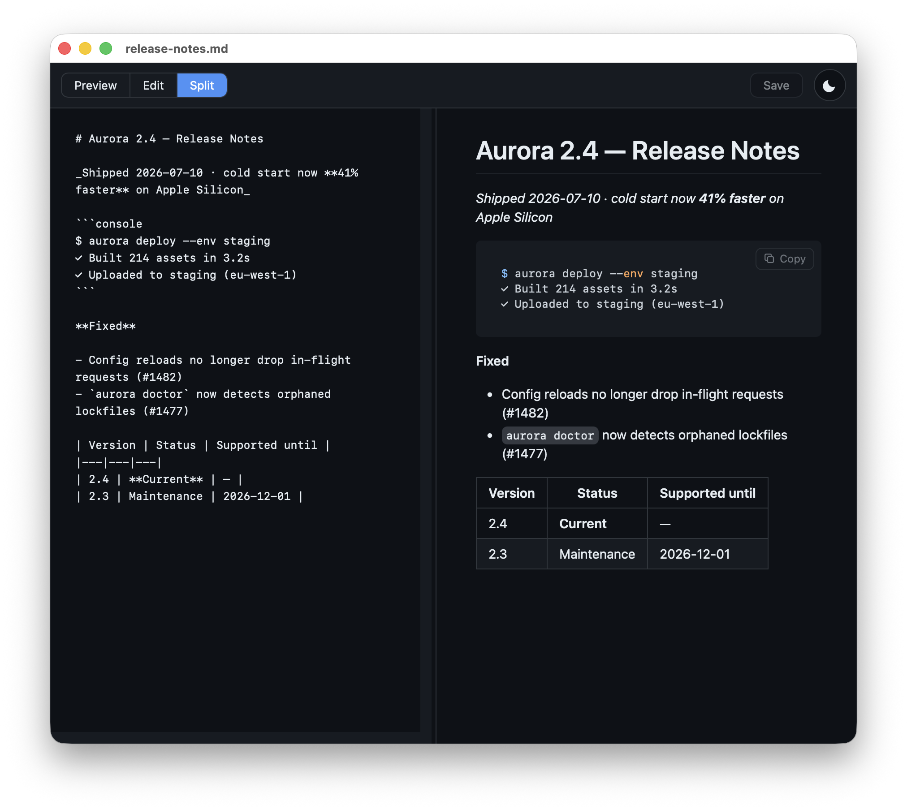
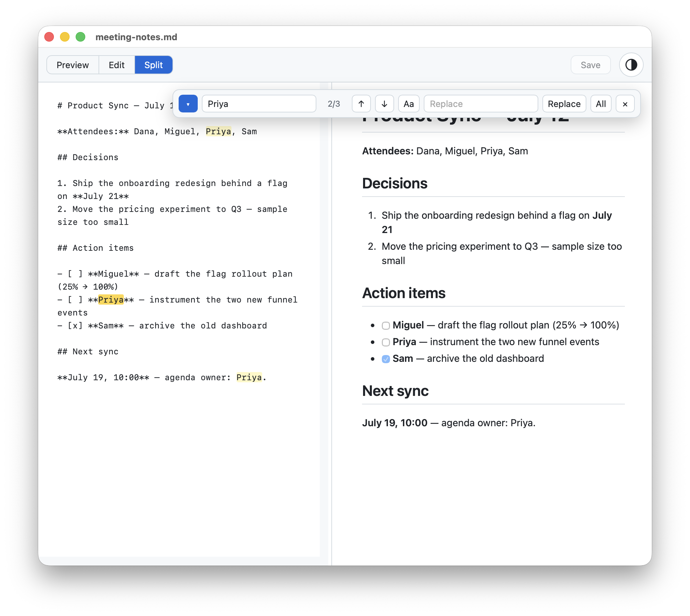

<div align="center">


# MarkdownViewer

**A fast, native Markdown viewer & editor for macOS and Windows.**
Preview, Edit, and Split with live rendering, synced scrolling, and
find & replace — 100% offline.


</div>

---

<div align="center">

*Split mode — raw markdown on the left, live preview on the right, scrolling in sync.*


<table>
  <tr>
    <td align="center"><br><sub><b>Dark theme</b> · highlighted code with copy buttons</sub></td>
    <td align="center"><br><sub><b>Find & Replace</b> · match count, case toggle</sub></td>
    <td align="center"><br><sub><b>About</b> · changelog & design docs built in</sub></td>
  </tr>
</table>

</div>

## Why

macOS only quick-looks `.md` files; Windows opens them in Notepad. MarkdownViewer
gives them a real home: double-click → a rendered document in a native window,
with just enough editor to fix a typo, tick a checkbox, and save — and nothing else.
No Electron, no accounts, no network. One native source file per platform driving
a system web view, ~700 lines each.

## Features

**Viewing**
- 📝 **Preview · Edit · Split** (`⌘1/2/3` · `Ctrl+1/2/3`) with a draggable splitter and synced scrolling
- 🌗 **Light / Dark / System** theme, GitHub-style rendering (marked + highlight.js, bundled)
- 🔎 **Zoom** (`⌘+/−/0`) that widens the column with the text — no re-wrapping
- 📋 **Copy buttons** on fenced code blocks; in-document anchor links that work
- 🔄 **Live reload** when the file changes on disk (paused while you have unsaved edits)

**Editing**
- 💾 **Save** (`⌘S` · `Ctrl+S`) with a dirty-dot and Save / Don't Save / Cancel guards on close *and* quit
- 🆕 **New documents** (`⌘N` · `Ctrl+N`) opening in Split mode; first save defaults to `.md`, any typed extension accepted
- 🔍 **Find & Replace** (`⌘F`/`⌥⌘F` · `Ctrl+F`/`Ctrl+H`) with match count and case toggle — undo-safe
- ↩️ **Wrap Lines** toggle; Tab inserts spaces without killing undo

**Files**
- 🗂️ **Tabs** — native window tabs on macOS; one tabbed window on Windows where Explorer-opened files join the running instance
- 🕘 **Open Recent** (last 10 files) and **Open Path…** (`⇧⌘G`) for pasted paths
- 🖱️ Drag & drop onto the window

**Trust**
- 🔒 **Zero network requests** — everything renders from bundled assets
- 🛡️ Documents are treated as untrusted: a Content-Security-Policy plus an HTML
  sanitizer keep raw-HTML markdown from running scripts or phoning home

## Install

**macOS** — paste in Terminal:

```bash
curl -fsSL https://raw.githubusercontent.com/dgodibadze/MarkdownViewer/main/install.sh | bash
```

**Windows** — paste in PowerShell:

```powershell
irm https://raw.githubusercontent.com/dgodibadze/MarkdownViewer/main/install.ps1 | iex
```

The installers handle the rest: macOS gets the latest DMG from
[Releases](../../releases) (or builds from source) into `/Applications`;
Windows gets the self-contained build, the WebView2 Runtime if missing, and a
Start Menu shortcut — no admin rights needed.

<details>
<summary><b>Manual install & building from source</b></summary>

### macOS — download

1. Grab **`MarkdownViewer.dmg`** from [Releases](../../releases) and drag the app to **Applications**.
2. First launch: the app is ad-hoc signed, so Gatekeeper may warn. **Right-click → Open**, or:
   ```bash
   xattr -dr com.apple.quarantine /Applications/MarkdownViewer.app
   ```
3. Default app for `.md`: right-click a file → **Get Info** → **Open with** → **Change All…**

### macOS — build (universal binary, no Xcode project)

Requires the Xcode command line tools (`xcode-select --install`); internet on the first build only.

```bash
git clone https://github.com/dgodibadze/MarkdownViewer.git
cd MarkdownViewer
./build.sh            # arm64 + x86_64 → MarkdownViewer.app
./make-dmg.sh         # optional: MarkdownViewer.dmg
```

### Windows — build

Requires the [.NET 8 SDK](https://dotnet.microsoft.com/download/dotnet/8.0).

```powershell
cd windows
.\build.ps1            # → bin\Release\net8.0-windows\MarkdownViewer.exe
.\build.ps1 -Publish   # self-contained single file → dist\MarkdownViewer.exe
```

See [`windows/README.md`](windows/README.md) for details.

</details>

## Shortcuts

| Action | macOS | Windows |
|---|---|---|
| Preview / Edit / Split | `⌘1` / `⌘2` / `⌘3` | `Ctrl+1` / `Ctrl+2` / `Ctrl+3` |
| New / Save | `⌘N` / `⌘S` | `Ctrl+N` / `Ctrl+S` |
| Find / Find & Replace | `⌘F` / `⌥⌘F` | `Ctrl+F` / `Ctrl+H` |
| Open / Open Path / Close | `⌘O` / `⇧⌘G` / `⌘W` | `Ctrl+O` / `Ctrl+Shift+G` / `Ctrl+W` |
| Reload from disk | `⌘R` | `Ctrl+R` or `F5` |
| Zoom in / out / reset | `⌘+` / `⌘−` / `⌘0` | `Ctrl +` / `Ctrl −` / `Ctrl 0` |

Try it on the staged demo docs in [`docs/examples/`](docs/examples) — three
one-page documents covering tables, task lists, highlighted code, and quotes.

## How it works

One native source file per platform drives a system web view that renders a
shared, bundled HTML template, talking to it over a small message bridge:

| | macOS | Windows |
|---|---|---|
| Shell | `Sources/main.swift` (AppKit) | `windows/Program.cs` (WinForms) |
| Web view | WKWebView | WebView2 |
| Binary | Universal (arm64 + x86_64) | win-x64, single file |

The full design — rendering pipeline, save/dirty invariants, security model,
scroll-sync approach — is documented in
[`Resources/DESIGN.md`](Resources/DESIGN.md) and
[`Resources/ARCHITECTURE.md`](Resources/ARCHITECTURE.md) (both readable from
the app's About window), with history in [`CHANGELOG.md`](CHANGELOG.md).
Contributions welcome — see [`CONTRIBUTING.md`](CONTRIBUTING.md).

## License & credits

Licensed under the **GNU GPL v3.0** — see [`LICENSE.txt`](LICENSE.txt). MarkdownViewer began as
a companion to **[QLMarkdown](https://github.com/sbarex/QLMarkdown) by sbarex** (also GPLv3); it
is independent code and remains under GPLv3 with attribution. Bundled libraries — **marked**
(MIT), **highlight.js** (BSD-3-Clause), **github-markdown-css** (MIT) — are credited in
[`NOTICE.md`](NOTICE.md). If you publish a fork, keep the GPLv3 license, this attribution, and
`NOTICE.md`.
