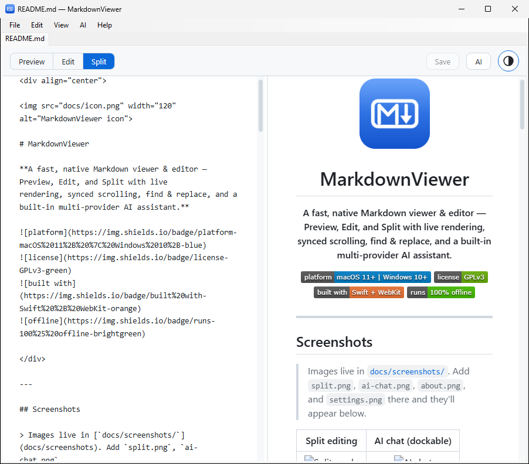
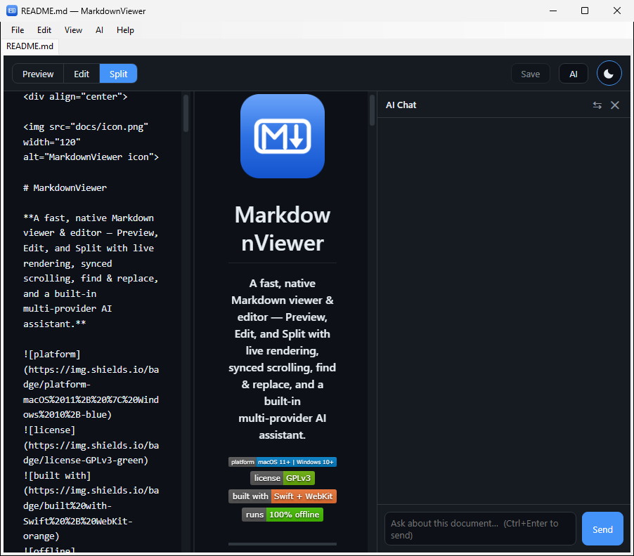
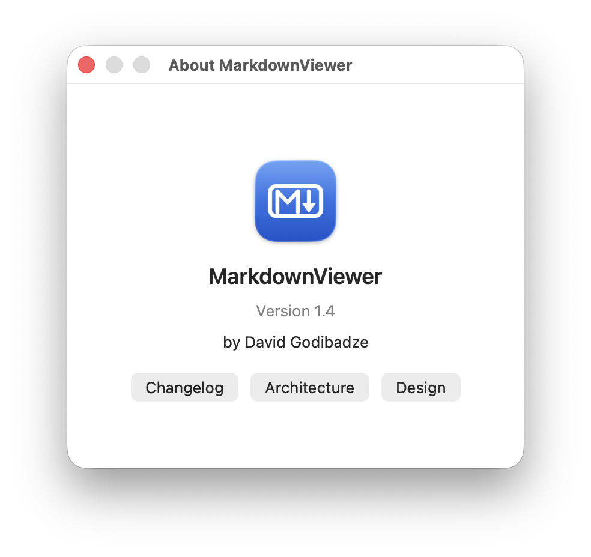
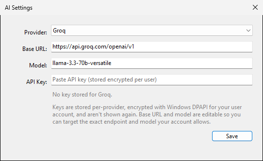

<div align="center">


# MarkdownViewer

**A fast, native Markdown viewer & editor — Preview, Edit, and Split with live
rendering, synced scrolling, find & replace, and a built-in multi‑provider AI assistant.**


</div>

---

## Screenshots

> Images live in [`docs/screenshots/`](docs/screenshots). Add `split.png`, `ai-chat.png`,
> `about.png`, and `settings.png` there and they'll appear below.

| Split editing | AI chat (dockable) |
|:---:|:---:|
|  |  |
| **About** | **AI settings** |
|  |  |

## Features

- 📝 **Preview · Edit · Split** modes (`⌘1` / `⌘2` / `⌘3`) with a GitHub-style toolbar toggle
- ↔️ **Draggable splitter** + **synced scrolling** between editor and preview (drag the divider; double-click to reset)
- 💾 **Edit and save to disk** (`⌘S`) with an unsaved-changes dot and a Save / Don't Save / Cancel guard on close
- 🔍 **Find & Replace** (`⌘F` / `⌥⌘F`): match count, next/prev, replace one/all, case toggle
- ↩️ **Wrap Lines** toggle (`View ▸ Wrap Lines`) — soft-wrap or horizontal scroll
- 🤖 **AI assistant** — Improve a selection, chat about the document, or generate-and-insert, across **Groq, Nous Portal, OpenAI, Anthropic, and Gemini**. Dockable chat panel (right / left / bottom)
- 🌗 **Light / Dark / System** theme (circular toggle), follows the OS
- 🗂️ **Tabs** — multiple files as native window tabs, each with independent state
- 🔄 **Live reload** when the file changes on disk (paused while you have unsaved edits)
- 🔒 **100% offline** rendering (marked + highlight.js + GitHub CSS bundled); AI calls go only to the provider you configure

## Install (one line)

**macOS** — paste in Terminal:

```bash
curl -fsSL https://raw.githubusercontent.com/dgodibadze/MarkdownViewer/main/install.sh | bash
```

**Windows** — paste in PowerShell:

```powershell
irm https://raw.githubusercontent.com/dgodibadze/MarkdownViewer/main/install.ps1 | iex
```

Each installer detects everything else automatically: on macOS it grabs the latest DMG
from [Releases](../../releases) (or builds from source if the release has no DMG yet) and
installs to `/Applications`; on Windows it downloads the self-contained build, installs
the WebView2 Runtime if missing, and adds a Start Menu shortcut — no admin rights needed.
The `curl` line even works in **Git Bash on Windows** (it hands off to the PowerShell
installer), so one command covers both platforms if Git Bash is your shell.

## Windows version

A full Windows port lives in [`windows/`](windows) — same features and the same bundled
rendering assets, built with C# + WebView2 instead of Swift + WebKit (tabs, live reload,
find & replace, AI assistant with DPAPI-encrypted keys, light/dark/system theme). See
[`windows/README.md`](windows/README.md) for build and usage.

## Manual install (macOS)

### Download

1. Download the latest **`MarkdownViewer.dmg`** from the [Releases](../../releases) page.
2. Open it and drag **MarkdownViewer** onto **Applications**.
3. First launch: the app is ad-hoc signed (no paid Developer ID), so macOS Gatekeeper may
   warn. **Right-click the app → Open**, or run:
   ```bash
   xattr -dr com.apple.quarantine /Applications/MarkdownViewer.app
   ```

To make it the default for `.md` files: right-click a Markdown file → **Get Info** → **Open
with** → **MarkdownViewer** → **Change All…**

### Build from source

Requires the Xcode command line tools (`xcode-select --install`) and internet on the first
build (to fetch the bundled JS/CSS, cached afterward).

```bash
git clone https://github.com/<you>/MarkdownViewer.git
cd MarkdownViewer
./build.sh            # produces MarkdownViewer.app
./make-dmg.sh         # optional: produces MarkdownViewer.dmg
```

## Usage

| Action | Shortcut |
|---|---|
| Preview / Edit / Split | `⌘1` / `⌘2` / `⌘3` |
| Save | `⌘S` |
| Find / Find & Replace | `⌘F` / `⌥⌘F` |
| Open / Close / Reload | `⌘O` / `⌘W` / `⌘R` |
| Send chat message | `⌘↵` |

- **Resize the split** by dragging the divider; **double-click** it for 50/50.
- **Move the AI chat panel** with the ⇆ button in its header (right → left → bottom).

## AI setup

1. **AI ▸ Settings…**, pick a provider, paste your API key, and (optionally) edit the base
   URL and model.
2. Use **AI ▸ Improve Selection**, **Generate & Insert…**, or **Chat** (or the toolbar **AI** button).

Keys are stored **per-provider in the macOS Keychain** and never leave your machine except in
the request to the provider you chose. Default model ids are best-guesses and **editable** —
if a call returns an HTTP 400/404 about the model, just correct the **Model** field.

## How it works

One Swift file (`Sources/main.swift`) drives one `WKWebView` per window that renders a bundled
HTML template; Swift ↔ JS talk over a small message bridge. See
[`Resources/ARCHITECTURE.md`](Resources/ARCHITECTURE.md) for the full design and
[`Resources/CHANGELOG.md`](Resources/CHANGELOG.md) for history.

## License & credits

Licensed under the **GNU GPL v3.0** — see [`LICENSE.txt`](LICENSE.txt). MarkdownViewer began as
a companion to **[QLMarkdown](https://github.com/sbarex/QLMarkdown) by sbarex** (also GPLv3); it
is independent code and remains under GPLv3 with attribution. Bundled libraries — **marked**
(MIT), **highlight.js** (BSD-3-Clause), **github-markdown-css** (MIT) — are credited in
[`NOTICE.md`](NOTICE.md). If you publish a fork, keep the GPLv3 license, this attribution, and
`NOTICE.md`.
